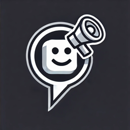

# 📢 Discord AI Announcement Bot | AnnounceMe

A simple **Discord bot** that formats announcements using **AI (GPT-4o)** for a professional and engaging community experience.

---

## 🚀 What This Bot Does  
- Uses **slash commands (`/announcement_creation`)** to generate AI-powered announcements.
- Intentions to speed up the user experience with community management.
- Formats text with **Markdown & emoji** to enhance readability.  
- Runs **24/7 on Railway** for continuous operation.  

---

## 🎯 Commands Integrated so far. 
| Command | Description |
|---------|-------------|
| `/announcement_creation [text]` | Generates a formatted announcement using GPT-4o and user input. |

---

## ⚡ What I Did  
✅ Built a Discord bot that generates **AI-powered announcements**.  
✅ Built the bot using **Node.js** alongside multiple dependencies.
✅ Integrated **GitHub AI models (GPT-4o)** for text formatting.  
✅ Hosted it on **Railway** for **24/7 uptime**.  
✅ Used **slash commands** for a seamless Discord experience.  

---

📌 **Future Plans:** Expand customization options, add more integration to allow for custom server announcements based off message history, add scheduling features.  
